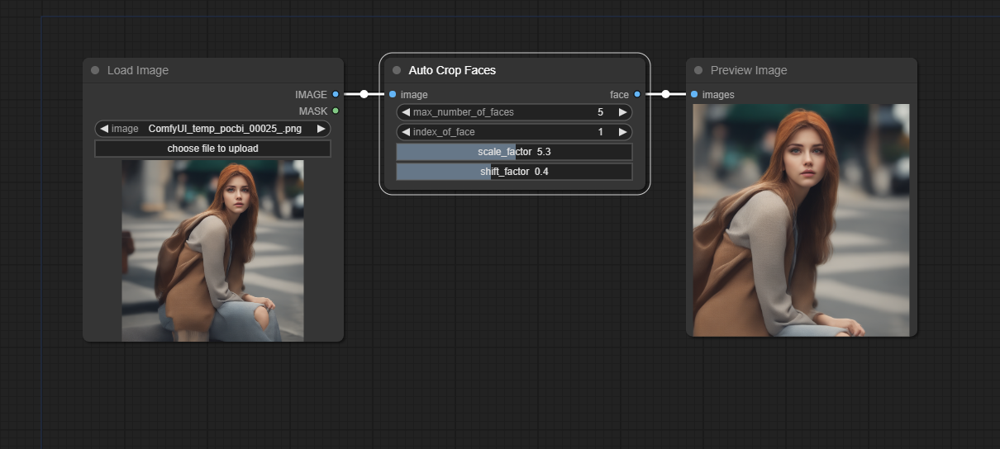
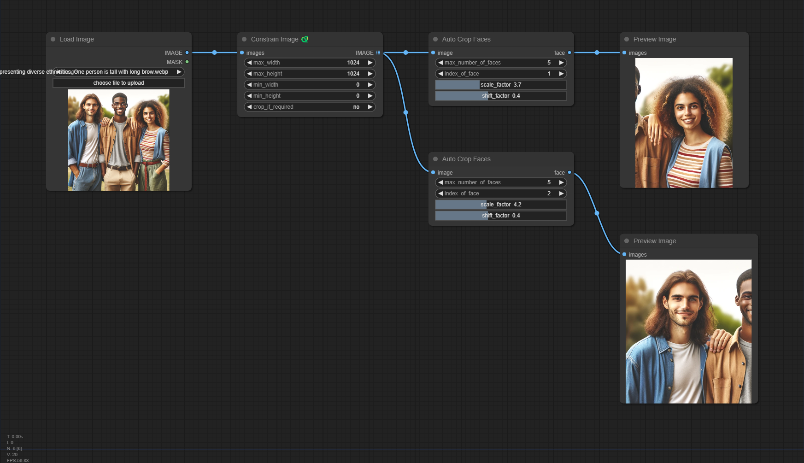
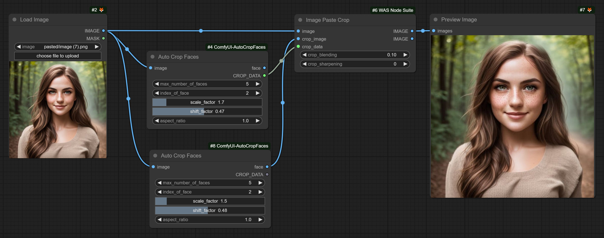

# ComfyUI-AutoCropFaces
Use RetinaFace to detect and automatically crop faces

Forked and modified from [biubug6/Pytorch_Retinaface](https://github.com/biubug6/Pytorch_Retinaface)

## Custom Nodes

### Auto Crop Faces

Detect faces and focus on one of them.

Sure, here is the updated documentation:

### Auto Crop Faces

Detect faces and focus on one of them.

* `number_of_faces`: How many faces would you like to detect in total? (default: 5, min: 1, max: 100)

* `start_index`: Which face would you like to start with? (default: 0, step: 1). The starting index of the detected faces list. If the start index is out of bounds, it wraps around in a circular fashion just like a Python list.

* `scale_factor`: How much padding would you like to add? 1 for no padding. (default: 1.5, min: 0.5, max: 10, step: 0.5)

* `shift_factor`: Where would you like the face to be placed in the output image? Set to 0 to place the face at the top edge, 0.5 to center it, and 1.0 to place it at the bottom edge. (default: 0.45, min: 0, max: 1, step: 0.01)

* `max_faces_per_image`: The maximum number of faces to detect for each image. (default: 50, min: 1, max: 1000, step: 1)

* `aspect_ratio`: The aspect ratio for cropping, specified as `width` : `height`. (default: 1:1)

Recommandation:

Users might upload extremely large images, so it would be a good idea to first pass through the ["Constrain Image"](https://github.com/pythongosssss/ComfyUI-Custom-Scripts#constrain-image) node.

It now supports CROP_DATA, which is compatible with [WAS node suite](https://github.com/WASasquatch/was-node-suite-comfyui).

